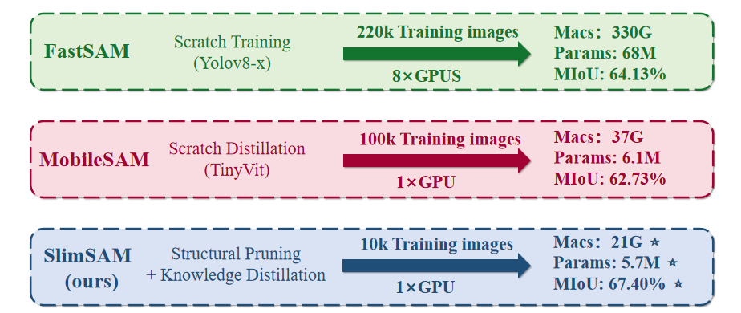
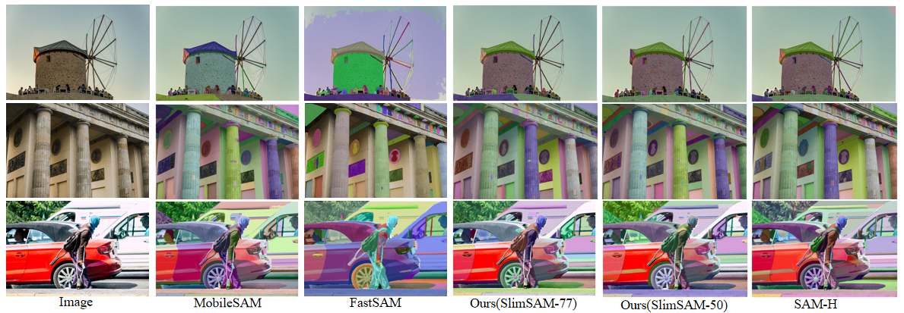
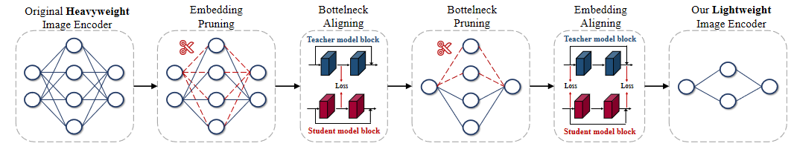

# SlimSAM: 0.1% Data Makes Segment Anything Slim
<div align="center">


</div>

> **0.1% Data Makes Segment Anything Slim**   
> [Zigeng Chen](https://github.com/czg1225), [Xinyin Ma](https://horseee.github.io/), [Gongfan Fang](https://fangggf.github.io/), [Xinchao Wang](https://sites.google.com/site/sitexinchaowang/)   
> [Learning and Vision Lab](http://lv-nus.org/), National University of Singapore  
> Paper: [[Arxiv]](https://arxiv.org/abs/2312.00858)


## Introduction

<div align="center">

</div>
<!--  -->

**SlimSAM** is a novel SAM compression method, which efficiently reuses pre-trained SAMs without the necessity for extensive retraining. This is achieved by the efficient reuse of pre-trained SAMs through a unified pruning-distillation framework. SlimSAM achieves approaching performance while reducing the parameter counts to **0.9\% (5.7M)**, MACs to **0.8\% (21G)**, and requiring mere **0.1\% (10k)** of the training data when compared to the original SAM-H. Extensive experiments demonstrate that our method realize significant superior performance while utilizing over **10 times** less training data when compared to other SAM compression methods.


## Installation

The code requires `python>=3.8`, as well as `pytorch>=1.7` and `torchvision>=0.8`. Please follow the instructions [here](https://pytorch.org/get-started/locally/) to install both PyTorch and TorchVision dependencies. Installing both PyTorch and TorchVision with CUDA support is strongly recommended.


Install with

```
pip install -e .
```

The following optional dependencies are necessary for mask post-processing, saving masks in COCO format.

```
pip install opencv-python pycocotools matplotlib 
```

## Dataset
We use the original SA-1B dataset in our code. See [here](https://ai.facebook.com/datasets/segment-anything/) for an overview of the datastet. The dataset can be downloaded [here](https://ai.facebook.com/datasets/segment-anything-downloads/).


To decode a mask in COCO RLE format into binary:

```
from pycocotools import mask as mask_utils
mask = mask_utils.decode(annotation["segmentation"])
```

See [here](https://github.com/cocodataset/cocoapi/blob/master/PythonAPI/pycocotools/mask.py) for more instructions to manipulate masks stored in RLE format.


## <a name="Models"></a>Model Checkpoints

The base model of our method is available. To enhance collaboration with our dependency dectection algorithm, we have split the original image encoder's qkv layer into three distinct linear layers: q, k, and v.
<div align="center">

</div>


Click the links below to download the checkpoints of orginal SAM-B.

- `SAM-B`: [SAM-B model.](https://drive.google.com/file/d/1CtcyOm4h9bXgBF8DEVWn3N7g9-3r4Xzz/view?usp=sharing)

The check points of our SlimSAM are avalable. We release two versions, which are SlimSAM-50 (pruning ratio = 50%) and SlimSAM-77 (pruning ratio = 77%).

Click the links below to download the checkpoints for the corresponding pruning ratio.

- `SlimSAM-50`: [SlimSAM-50 model.](https://drive.google.com/file/d/1iCN9IW0Su0Ud_fOFoQUnTdkC3bFveMND/view?usp=sharing)
- `SlimSAM-77`: [SlimSAM-77 model.](https://drive.google.com/file/d/1L7LB6gHDzR-3D63pH9acD9E0Ul9_wMF-/view)


These models can be instantiated by running

```
import torch
SlimSAM_model = torch.load(<model_path>)
SlimSAM_model.image_encoder = SlimSAM_model.image_encoder.module

def forward(self, x):

    x = self.patch_embed(x)
    if self.pos_embed is not None:
        x = x + self.pos_embed

    for blk in self.blocks:
        x,qkv_emb,mid_emb,x_emb = blk(x)

    x = self.neck(x.permute(0, 3, 1, 2))
    
    return x

import types
funcType = types.MethodType
SlimSAM_model.image_encoder.forward = funcType(forward, SlimSAM_model.image_encoder)
```


## <a name="Inference"></a>Inference

First download [SlimSAM-50 model](https://drive.google.com/file/d/1iCN9IW0Su0Ud_fOFoQUnTdkC3bFveMND/view?usp=sharing) or  [SlimSAM-77 model](https://drive.google.com/file/d/1L7LB6gHDzR-3D63pH9acD9E0Ul9_wMF-/view) for inference


We provide detailed instructions in 'inference.py' on how to use a range of prompts, including 'point' and 'box' and 'everything', for inference purposes.

```
CUDA_VISIBLE_DEVICES=0 python inference.py
```

## <a name="Train"></a>Train

First download a [SAM-B model](https://drive.google.com/file/d/1CtcyOm4h9bXgBF8DEVWn3N7g9-3r4Xzz/view?usp=sharing) into 'checkpoints/' as the base model. 

### Step1: Embedding Pruning + Bottleneck Aligning ###
The model after step1 is saved as 'checkpoints/vit_b_slim_step1_.pth'

```
CUDA_VISIBLE_DEVICES=0 python prune_distill_step1.py  --traindata_path <train_data_root> --valdata_path <val_data_root> --prune_ratio <pruning ratio> --epochs <training epochs>
```

### Step2: Bottleneck Pruning + Embedding Aligning ###
The model after step2 is saved as 'checkpoints/vit_b_slim_step2_.pth'

```
CUDA_VISIBLE_DEVICES=0 python prune_distill_step2.py  --traindata_path <train_data_root> --valdata_path <val_data_root> --prune_ratio <pruning ratio> --epochs <training epochs> --model_path 'checkpoints/vit_b_slim_step1_.pth' 

```


***********************************************************

<!-- CUDA_VISIBLE_DEVICES=0 python inference.py
CUDA_VISIBLE_DEVICES=0 nohup python prune_distill_step1.py &>> record/vitb_step1_50.txt &
CUDA_VISIBLE_DEVICES=1 nohup python prune_distill_step2.py &>> record/vitb_step2_50.txt &
CUDA_VISIBLE_DEVICES=0 python prune_distill_step2.py --trainsize 8 --valsize 1 --gradsize 10 --epochs 3 -->
CUDA_VISIBLE_DEVICES=1 nohup python predict2.py &>> record/predict77_box.txt &
CUDA_VISIBLE_DEVICES=0 nohup python predict2.py &>> record/predict50_box.txt &
CUDA_VISIBLE_DEVICES=1 nohup python predict2.py &>> record/vitb_box.txt &
CUDA_VISIBLE_DEVICES=1 nohup python predict3.py &>> record/predictmob_box.txt &
CUDA_VISIBLE_DEVICES=1 python predict3.py


