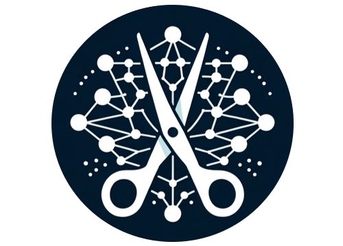

<div align="center">

</div>

<div align="center">
<h1>SlimSAM: 0.1% Data Makes Segment Anything Slim</h1>
  <div align="center">
  <a href="https://arxiv.org/abs/2312.05284">
    
  </a>
  <a href="https://pytorch.org/">
    =v1.7.1">
  </a>
  <a href="https://huggingface.co/Zigeng/SlimSAM-uniform-50">
    
  </a>
  <a href="https://huggingface.co/Zigeng/SlimSAM-uniform-77">
    
  </a>
  <a href="https://huggingface.co/spaces/Xenova/segment-anything-web">
    
  </a>
  <a href="https://colab.research.google.com/drive/1AQBGqjI51IERVibBKigTz_sra3CIVgR4?usp=sharing">
    
  </a>
</div>
</div>


> **0.1% Data Makes Segment Anything Slim**   
> [Zigeng Chen](https://github.com/czg1225), [Gongfan Fang](https://fangggf.github.io/), [Xinyin Ma](https://horseee.github.io/), [Xinchao Wang](https://sites.google.com/site/sitexinchaowang/)   
> [xML Lab](https://sites.google.com/view/xml-nus), National University of Singapore  
> Paper: [[Paper]](https://arxiv.org/abs/2312.05284)
<!-- > Colab: [](https://colab.research.google.com/drive/1AQBGqjI51IERVibBKigTz_sra3CIVgR4?usp=sharing) -->


### Updates
* 🚀 **March 22, 2024**: Awesome-Efficient-Segment-Anything is now available. Find more efficient SAMs [here](https://github.com/czg1225/Awesome-Efficient-Segment-Anything).
* 🚀 **January 10, 2024**: Run **SlimSAM** in your browser with :hugs: Transformers.js ([demo](https://huggingface.co/spaces/Xenova/segment-anything-web)).
* 🚀 **January 9, 2024**: Quickly loading using huggingface :hugs: :hugs: :hugs: .
* 🚀 **January 7, 2024**: Release models using uniform local pruning for easier state dict loading.
* 🚀 **December 19, 2023**: Release the Colab example for **SlimSAM**.
* 🚀 **December 11, 2023**: Release the training code, inference code and pre-trained models for **SlimSAM**. 


## Fast Start 🚀

#### Quickly loading with Huggingface :hugs::

``` python
from PIL import Image
from transformers import SamModel, SamProcessor

model = SamModel.from_pretrained("Zigeng/SlimSAM-uniform-50").to("cuda")
processor = SamProcessor.from_pretrained("Zigeng/SlimSAM-uniform-50")

img_url = "https://huggingface.co/ybelkada/segment-anything/resolve/main/assets/car.png"
raw_image = Image.open(requests.get(img_url, stream=True).raw).convert("RGB")
input_points = [[[450, 600]]] # 2D localization of a window
inputs = processor(raw_image, input_points=input_points, return_tensors="pt").to("cuda")
outputs = model(**inputs)
masks = processor.image_processor.post_process_masks(outputs.pred_masks.cpu(), inputs["original_sizes"].cpu(), inputs["reshaped_input_sizes"].cpu())
scores = outputs.iou_scores
```

## Introduction

<div align="center">

</div>

<div align="center">

</div>

**SlimSAM** is a novel data-efficient SAM compression method that achieves superior performance with extremely less training data. The essence of SlimSAM is encapsulated in the alternate slimming framework which effectively enhances knowledge inheritance under severely limited training data availability and exceptional pruning ratio. Diverging from prior techniques, our framework progressively compresses the model by alternately pruning and distilling distinct, decoupled sub-structures. Disturbed Taylor pruning is also proposed to address the misalignment between the pruning objective and training target, thereby boosting the post-distillation after pruning.


SlimSAM yields significant performance improvements while demanding **over 10 times less** training data than any other existing compression methods. Even when compared to the original SAM, SlimSAM achieves approaching performance while reducing parameter counts to merely **1.4\% (9.1M)**, MACs to **0.8\% (23G)**, and requiring only **0.1\% (10k)** of the SAM training data.

## Visualization Results

Qualitative comparison of results obtained using point prompts, box prompts, and segment everything prompts are shown.
### Box Prompts and Point Prompts


## Quantitative Results

We conducted a comprehensive comparison encompassing performance, efficiency, and training costs with other SAM compression methods and structural pruning methods.

### Comparing with other SAM compression methods.
<div align="center">
  
</div>

### Comparing with other structural pruning methods.
<div align="center">
  
</div>

## Installation

The code requires `python>=3.8`, as well as `pytorch>=1.7` and `torchvision>=0.8`. Please follow the instructions [here](https://pytorch.org/get-started/locally/) to install both PyTorch and TorchVision dependencies. Installing both PyTorch and TorchVision with CUDA support is strongly recommended.


Install with

```
pip install -e .
```

The following optional dependencies are necessary for mask post-processing, saving masks in COCO format.

```
pip install opencv-python pycocotools matplotlib 
```

## Dataset
We use the original SA-1B dataset in our code. See [here](https://ai.facebook.com/datasets/segment-anything/) for an overview of the datastet. The dataset can be downloaded [here](https://ai.facebook.com/datasets/segment-anything-downloads/).

The download dataset should be saved as:

```
<train_data_root>/
      sa_xxxxxxx.jpg
      sa_xxxxxxx.json
      ......
<val_data_root>/
      sa_xxxxxxx.jpg
      sa_xxxxxxx.json
      ......

```


To decode a mask in COCO RLE format into binary:

``` python
from pycocotools import mask as mask_utils
mask = mask_utils.decode(annotation["segmentation"])
```

See [here](https://github.com/cocodataset/cocoapi/blob/master/PythonAPI/pycocotools/mask.py) for more instructions to manipulate masks stored in RLE format.


## <a name="Models"></a>Model Checkpoints

The base model of our method is available. To enhance collaboration with our dependency dectection algorithm, we have split the original image encoder's qkv layer into three distinct linear layers: q, k, and v.
<div align="center">

</div>


Click the links below to download the checkpoints of orginal SAM-B.

- `SAM-B`: [SAM-B model.](https://drive.google.com/file/d/1CtcyOm4h9bXgBF8DEVWn3N7g9-3r4Xzz/view?usp=sharing)

The check points of our SlimSAM are avalable. We release two versions, which are SlimSAM-50 (pruning ratio = 50%) and SlimSAM-77 (pruning ratio = 77%).

Click the links below to download the checkpoints for the corresponding pruning ratio.

#### Global Pruning Models:

- `SlimSAM-50`: [SlimSAM-50 model.](https://drive.google.com/file/d/1bTjBZs2oWHeo6OPxumD_Gces4VCcU0JI/view?usp=sharing)
- `SlimSAM-77`: [SlimSAM-77 model.](https://drive.google.com/file/d/14BhU66umvY0E1FWoGsCMpLqXMNw9c3Nx/view?usp=sharing)


Above models can be instantiated by running

``` python
import torch
SlimSAM_model = torch.load(<model_path>)
SlimSAM_model.image_encoder = SlimSAM_model.image_encoder.module

def forward(self, x):

    x = self.patch_embed(x)
    if self.pos_embed is not None:
        x = x + self.pos_embed

    for blk in self.blocks:
        x,qkv_emb,mid_emb,x_emb = blk(x)

    x = self.neck(x.permute(0, 3, 1, 2))
    
    return x

import types
funcType = types.MethodType
SlimSAM_model.image_encoder.forward = funcType(forward, SlimSAM_model.image_encoder)
SlimSAM_model.to(device)
SlimSAM_model.eval()
```


#### Local Pruning Models:

- `SlimSAM-50-uniform`: [SlimSAM-50 model.](https://drive.google.com/file/d/1Ld7Q2LY8H2nu4zB6VxwwA5npS5A9OHFq/view?usp=sharing)
- `SlimSAM-77-uniform`: [SlimSAM-77 model.](https://drive.google.com/file/d/1OeWpfk5WhdlMz5VvYmb9gaE6suzHB0sp/view?usp=sharing)


Above models can be instantiated by running

``` python
import torch
from segment_anything import sam_model_registry

model_type = 'vit_p50'
checkpoint = 'checkpoints/SlimSAM-50-uniform.pth'
SlimSAM_model = sam_model_registry[model_type](checkpoint=checkpoint)
SlimSAM_model.to(device)
SlimSAM_model.eval()
```


## <a name="Inference"></a>Inference

First download [SlimSAM-50 model](https://drive.google.com/file/d/1iCN9IW0Su0Ud_fOFoQUnTdkC3bFveMND/view?usp=sharing) or  [SlimSAM-77 model](https://drive.google.com/file/d/1L7LB6gHDzR-3D63pH9acD9E0Ul9_wMF-/view) for inference


We provide detailed instructions in 'inference.py' on how to use a range of prompts, including 'point' and 'box' and 'everything', for inference purposes.

```
CUDA_VISIBLE_DEVICES=0 python inference.py
```

## <a name="Train"></a>Train

First download a [SAM-B model](https://drive.google.com/file/d/1CtcyOm4h9bXgBF8DEVWn3N7g9-3r4Xzz/view?usp=sharing) into 'checkpoints/' as the base model. 

### Step1: Embedding Pruning + Bottleneck Aligning ###
The model after step1 is saved as 'checkpoints/vit_b_slim_step1_.pth'

```
CUDA_VISIBLE_DEVICES=0 python prune_distill_step1.py  --traindata_path <train_data_root> --valdata_path <val_data_root> --prune_ratio <pruning ratio> --epochs <training epochs>
```

### Step2: Bottleneck Pruning + Embedding Aligning ###
The model after step2 is saved as 'checkpoints/vit_b_slim_step2_.pth'

```
CUDA_VISIBLE_DEVICES=0 python prune_distill_step2.py  --traindata_path <train_data_root> --valdata_path <val_data_root> --prune_ratio <pruning ratio> --epochs <training epochs> --model_path 'checkpoints/vit_b_slim_step1_.pth' 

```

You can adjust the training settings to meet your specific requirements. While our method demonstrates impressive performance with just 10,000 training data, incorporating additional training data will further enhance the model's effectiveness

## BibTex of our SlimSAM
If you use SlimSAM in your research, please use the following BibTeX entry. Thank you!

```bibtex
@article{chen20230,
  title={0.1\% Data Makes Segment Anything Slim},
  author={Chen, Zigeng and Fang, Gongfan and Ma, Xinyin and Wang, Xinchao},
  journal={arXiv preprint arXiv:2312.05284},
  year={2023}
}
```

## Acknowledgement

<details>
<summary>
<a href="https://github.com/facebookresearch/segment-anything">SAM</a> (Segment Anything) [<b>bib</b>]
</summary>

```bibtex
@article{kirillov2023segany,
  title={Segment Anything}, 
  author={Kirillov, Alexander and Mintun, Eric and Ravi, Nikhila and Mao, Hanzi and Rolland, Chloe and Gustafson, Laura and Xiao, Tete and Whitehead, Spencer and Berg, Alexander C. and Lo, Wan-Yen and Doll{\'a}r, Piotr and Girshick, Ross},
  journal={arXiv:2304.02643},
  year={2023}
}
```
</details>


<details>
<summary>
<a href="https://github.com/VainF/Torch-Pruning">Torch Pruning</a> (DepGraph: Towards Any Structural Pruning) [<b>bib</b>]
</summary>

```bibtex
@inproceedings{fang2023depgraph,
  title={Depgraph: Towards any structural pruning},
  author={Fang, Gongfan and Ma, Xinyin and Song, Mingli and Mi, Michael Bi and Wang, Xinchao},
  booktitle={Proceedings of the IEEE/CVF Conference on Computer Vision and Pattern Recognition},
  pages={16091--16101},
  year={2023}
}
```
</details>


***********************************************************


